Comparison of Existing Diff/Merge Tools
=======================================

SwiftCompare
------------

|image0|

|image1|

`http://www.oorjasoftware.com/product\_info.html <http://www.oorjasoftware.com/product_info.html>`__

`http://swiftcompare.software.informer.com/ <http://swiftcompare.software.informer.com/>`__

FourierRocks
------------

|image2|

|image3|

`http://sourceforge.net/projects/fourierrocks/ <http://sourceforge.net/projects/fourierrocks/>`__

`http://www.aca.gr/index/hiend/hiendArticles?row=2063 <http://www.aca.gr/index/hiend/hiendArticles?row=2063>`__

AudioGrabber
------------

|image4|

`http://www.audiograbber.org/ <http://www.audiograbber.org/>`__

FolderSynch
-----------

|image5|

Uses winmerge/FilePro for comparisons

`http://saleensoftware.com/FolderSync <http://saleensoftware.com/FolderSync>`__

Audio DiffMaker
---------------

|image6|

|image7|

`http://www.libinst.com/Audio%20DiffMaker.htm <http://www.libinst.com/Audio%20DiffMaker.htm>`__

Zynamics BinDiff
----------------

|image8|\ Changes in yellow new in red

|image9|

`http://www.zynamics.com/bindiff.html <http://www.zynamics.com/bindiff.html>`__

BinDiff
-------

|image10|

|image11|

`http://www.codeproject.com/Articles/509425/BinDiff-A-tool-to-compare-binary-files <http://www.codeproject.com/Articles/509425/BinDiff-A-tool-to-compare-binary-files>`__

Image Compare
-------------

|image12|

`http://sourceforge.net/projects/imagecomp/ <http://sourceforge.net/projects/imagecomp/>`__

Bolide Audio Comparer
---------------------

|image13|

`http://www.bolidesoft.com/audiocomparer/ <http://www.bolidesoft.com/audiocomparer/>`__

Bolide Image Comparer
---------------------

|image14|

`http://www.bolidesoft.com/imagecomparer.html <http://www.bolidesoft.com/imagecomparer.html>`__

Bolide Compare Suite
--------------------

|image15|

|image16|

|image17|

http://www.bolidesoft.com/compare-suite/screenshots.html

WinMerge
--------

|image18|

|image19|

|image20|

`http://winmerge.org/ <http://winmerge.org/>`__

QuickDiff
---------

|image21|

Online diff tool

http://www.quickdiff.com/

PrestoSoft ExamDiff
-------------------

|image22|

|image23|

|image24|

|image25|

http://www.prestosoft.com/edp\_examdiffpro.asp

KaleidoScope
------------

|image26|

|image27|

|image28|

|image29|

|image30|

|image31|

|image32|

|image33|

`http://www.kaleidoscopeapp.com/ <http://www.kaleidoscopeapp.com/>`__

Docu-Proof Enterprise
--------------------------------

|image34|

|image35|

`http://www.globalvisioninc.com/products/docuproof.php <http://www.globalvisioninc.com/products/docuproof.php>`__

WorkShare Compare
-----------------

|image36|

|image37|

`http://www.workshare.com/products <http://www.workshare.com/products>`__

SoftInterface Diff Doc
----------------------

|image38|

`http://www.softinterface.com/MD%5CDocument-Comparison-Software.htm <http://www.softinterface.com/MD%5CDocument-Comparison-Software.htm>`__

Araxis Merge
------------

|image39|

|image40|

|image41|

Shows only the pixels that are different between the two files.

|image42|

|image43|

|image44|

`http://www.araxis.com/merge/ <http://www.araxis.com/merge/>`__

` <http://www.araxis.com/merge/>`__

BitBQ Changes
-------------

|image45|

|image46|

`http://bitbq.com/changes/images/TextDiff.png <http://bitbq.com/changes/images/TextDiff.png>`__

Devart Code Compare
-------------------

|image47|

|image48|

|image49|

`http://www.devart.com/codecompare/ <http://www.devart.com/codecompare/>`__

Compare++
---------

|image50|

Able to compare using with programming language.

|image51|

|image52|

http://cmpp.coodesoft.com/

Sourcegear DiffMerge
--------------------

|image53|

|image54|

|image55|

`http://sourcegear.com/diffmerge/index.html <http://sourcegear.com/diffmerge/index.html>`__

Pretty Diff
-----------

|image56|

|image57|

`http://prettydiff.com/ <http://prettydiff.com/>`__

Kompare
-------

|image58|

`http://www.caffeinated.me.uk/kompare/ <http://www.caffeinated.me.uk/kompare/>`__

Ultra Compare
-------------

|image59|

|image60|

|image61|

|image62|

`http://www.ultraedit.com/products/ultracompare.html/ <http://www.ultraedit.com/products/ultracompare.html/>`__

Code Difference Comparison Tool
-------------------------------

|image63|

|image64|

|image65|

`http://www.tareeinternet.com/scripts/comparison-tool/ <http://www.tareeinternet.com/scripts/comparison-tool/>`__

Diffuse
-------

|image66|

`http://diffuse.sourceforge.net/index.html <http://diffuse.sourceforge.net/index.html>`__

Compare&Merge
-------------

|image67|

`http://www.compareandmerge.com/ <http://www.compareandmerge.com/>`__

Formula Software
----------------

|image68|

|image69|

|image70|

`http://www.formulasoft.com/index.html <http://www.formulasoft.com/index.html>`__

ColorDiffs
----------

|image71|

Not really a diff tool but a tool to improve the style of Subversion,

CVS, Mercurial, etc diff messages.

`http://code.google.com/p/colorediffs/ <http://code.google.com/p/colorediffs/>`__

Compare PDF
-----------

|image72|

|image73|

|image74|

Seems either Bolide or Compare PDF used each other’s code…

`http://www.compare-pdf.com/ <http://www.compare-pdf.com/>`__

DiffPDF

|image75|

`http://www.qtrac.eu/diffpdf.html <http://www.qtrac.eu/diffpdf.html>`__

Meld
----

|image76|

|image77|

|image78|

`http://meldmerge.org/ <http://meldmerge.org/>`__

.. |image0| image:: images/image33.png

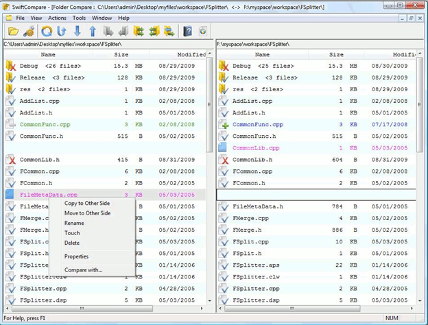

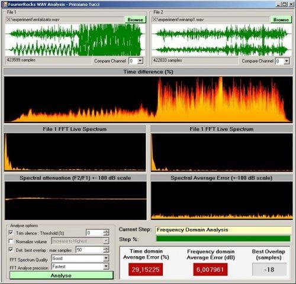

.. |image3| image:: images/image49.png

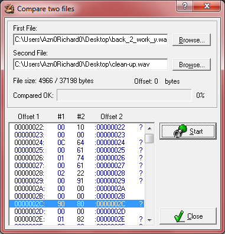

.. |image5| image:: images/image41.png

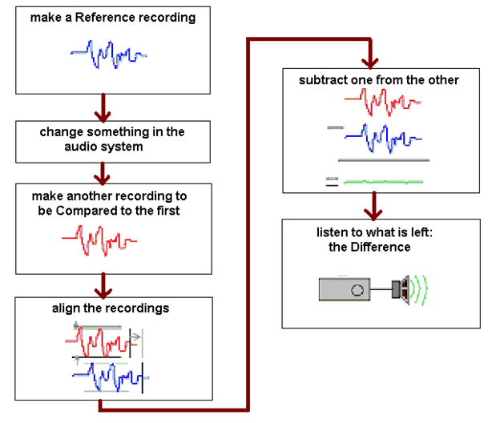

.. |image7| image:: images/image06.png

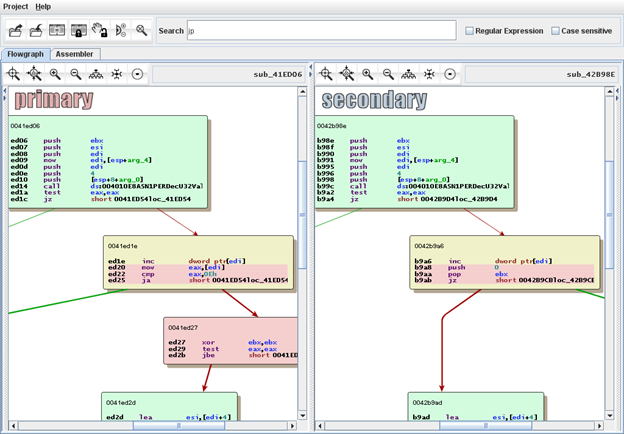

.. |image9| image:: images/image50.png

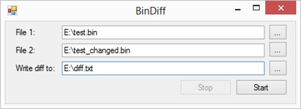

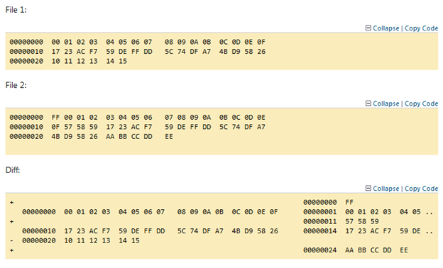

.. |image12| image:: images/image75.png

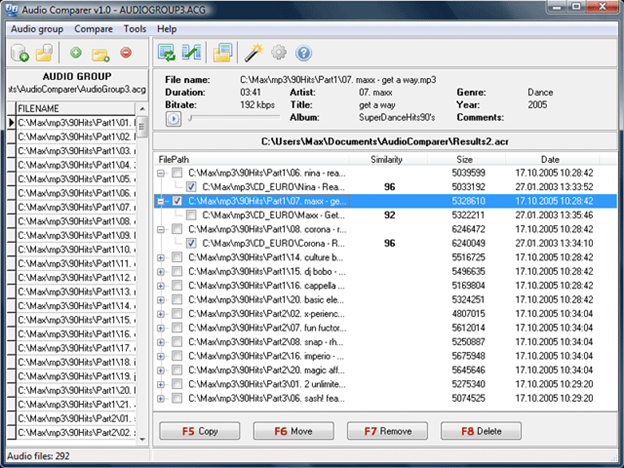

.. |image14| image:: images/image48.png

.. |image15| image:: images/image63.png

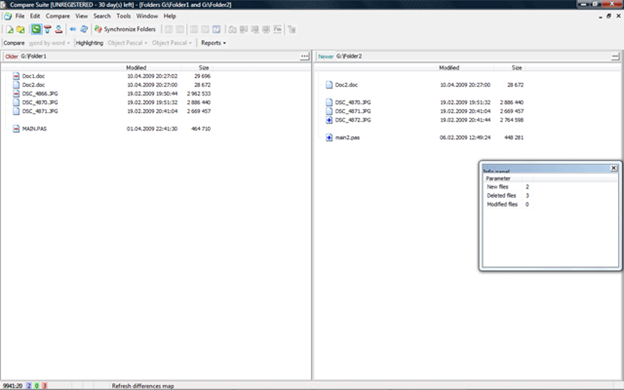

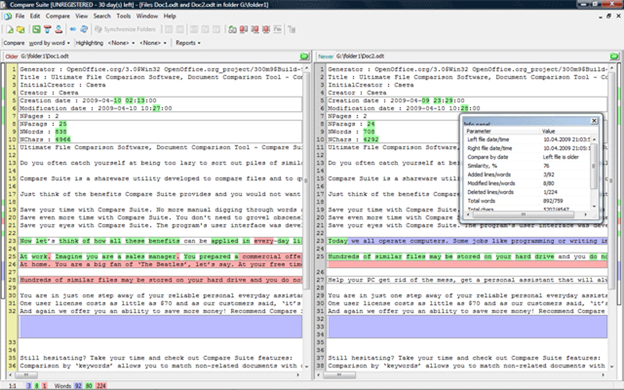

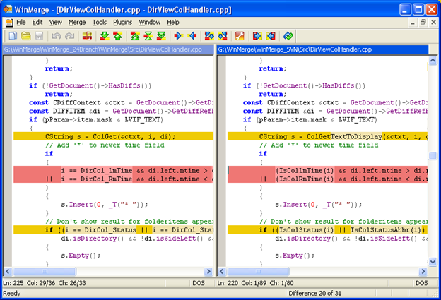

.. |image19| image:: images/image53.png

.. |image20| image:: images/image04.png

.. |image21| image:: images/image18.png

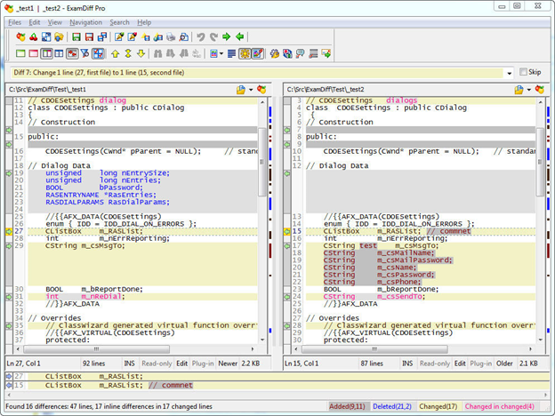

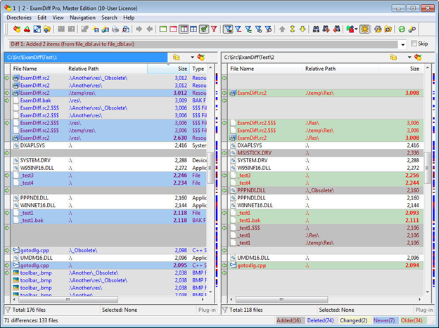

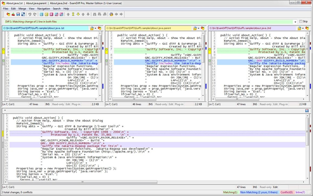

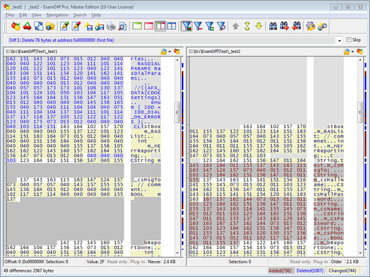

.. |image26| image:: images/image69.png

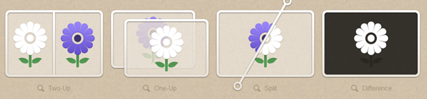

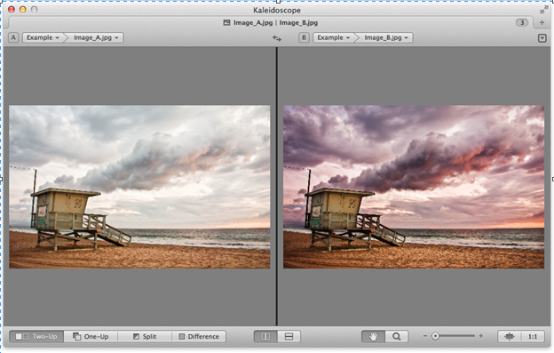

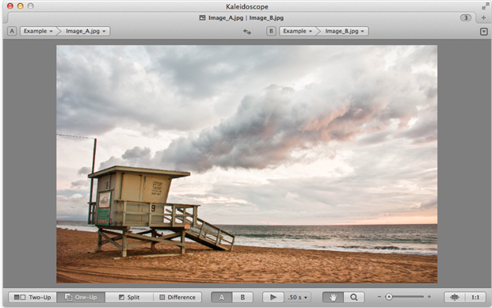

.. |image30| image:: images/image74.png

.. |image31| image:: images/image68.png

.. |image32| image:: images/image24.png

.. |image33| image:: images/image22.png

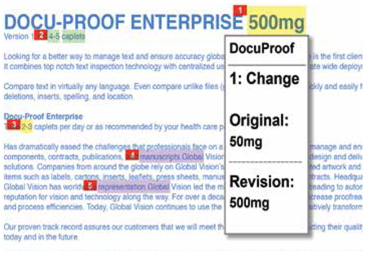

.. |image35| image:: images/image66.png

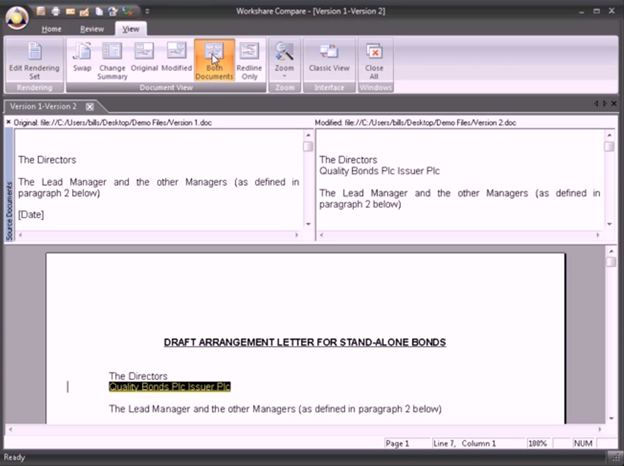

.. |image37| image:: images/image27.png

.. |image38| image:: images/image30.png

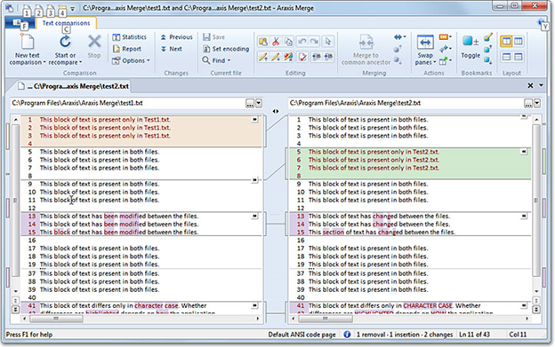

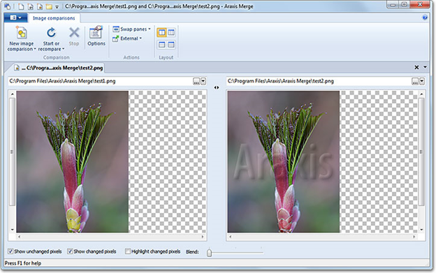

.. |image41| image:: images/image14.png

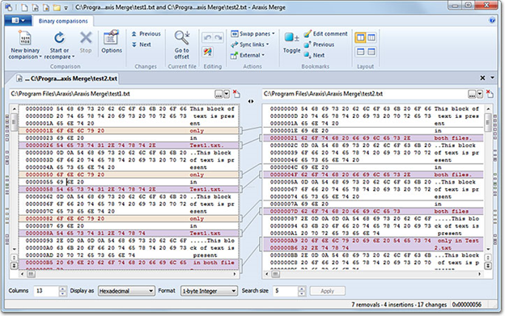

.. |image43| image:: images/image03.png

.. |image44| image:: images/image15.png

.. |image45| image:: images/image31.png

.. |image46| image:: images/image47.png

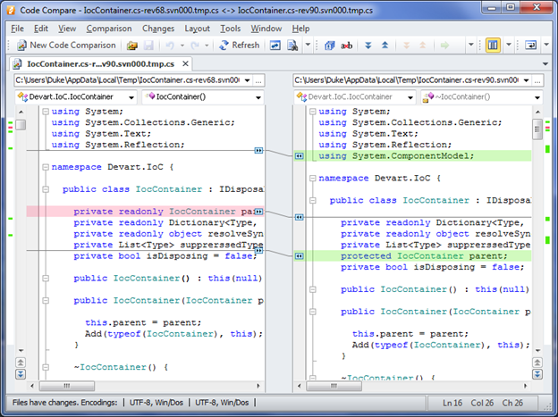

.. |image48| image:: images/image35.png

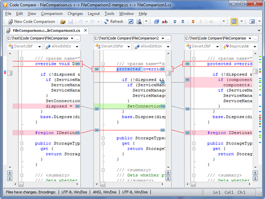

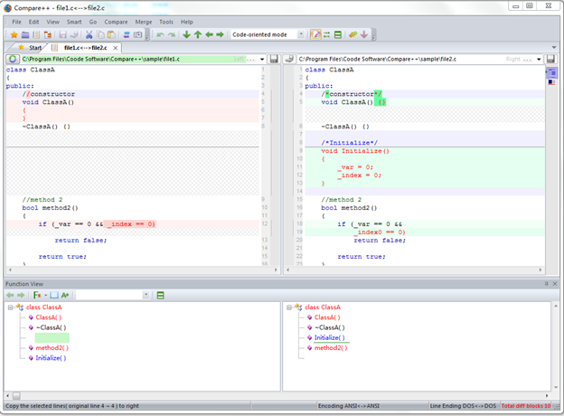

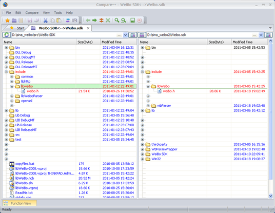

.. |image52| image:: images/image37.png

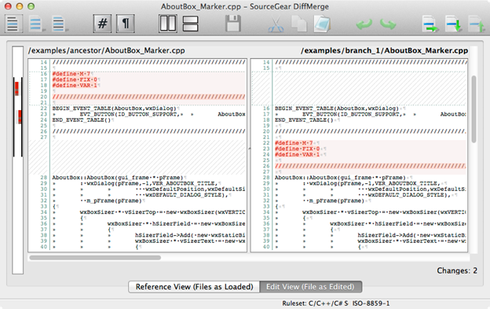

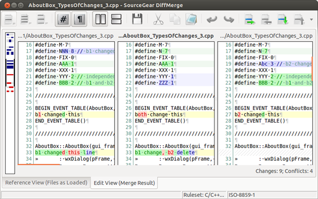

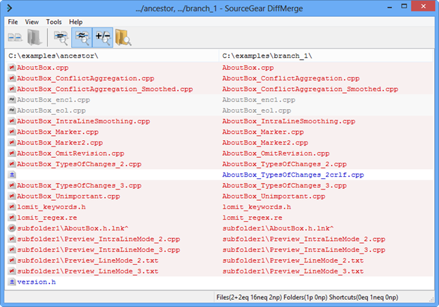

.. |image56| image:: images/image67.png

.. |image57| image:: images/image43.png

.. |image58| image:: images/image59.png

.. |image59| image:: images/image73.png

.. |image60| image:: images/image60.png

.. |image61| image:: images/image21.png

.. |image62| image:: images/image20.png

.. |image63| image:: images/image65.png

.. |image64| image:: images/image09.png

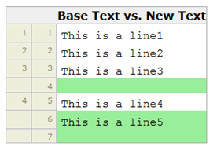

.. |image66| image:: images/image52.png

.. |image67| image:: images/image01.png

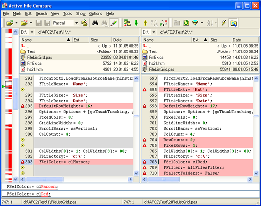

.. |image69| image:: images/image70.png

.. |image70| image:: images/image08.png

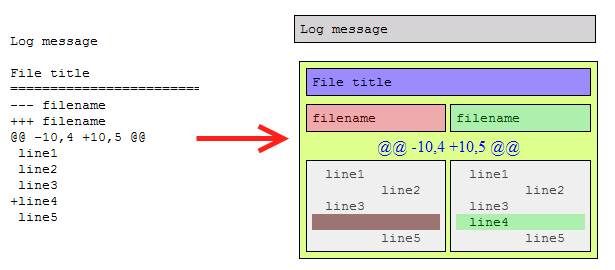

.. |image72| image:: images/image10.png

.. |image73| image:: images/image78.png

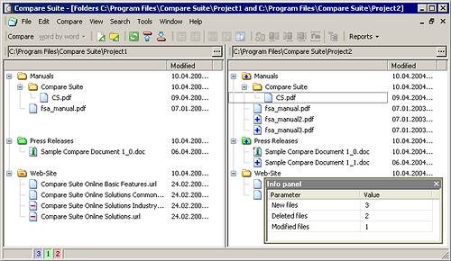

.. |image75| image:: images/image72.png

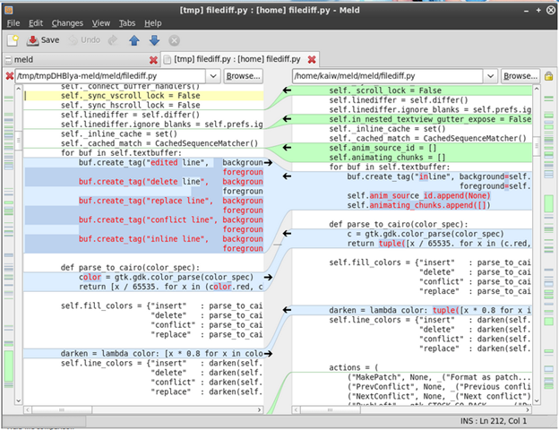

.. |image77| image:: images/image77.png

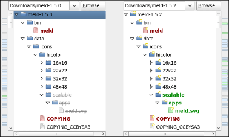

