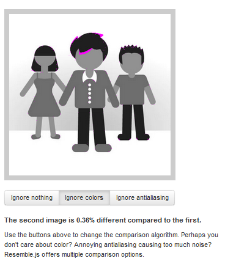

How the IPython Notebook Generates Images from the JSON Format
--------------------------------------------------------------

The following is an excerpt from a .ipynb

::

    {

             "cell_type": "code",
             "collapsed": false,
             "input": "fig1",
             "language": "python",
             "metadata": {},
             "outputs": [
              {
               "metadata": {},
               "output_type": "pyout",
               "png":
    "iVBORw0KGgoAAAANSUhEUgAAArUAAAI4CAYAAAB0jhFHAA   [ snip! ]"
               "prompt_number": 39,
               "text": "<matplotlib.figure.Figure at 0xb5308d0>"
              }
             ],
             "prompt_number": 39

        

The image cell with the png shown above is generated as:

::

    

      
Out[39]:

        

          

            
            

            

            

          

          

        

      

    

* Note: I’ve removed the actual string representation of the PNG in
order to shorten the html code. The PNG is the exact same string as the
one indicated in the above .json from the .ipynb. From observation the
``\n`` in the string do not affect the .png generation.

The javascript that is responsible for the html is
`outputarea.js <https://github.com/ipython/ipython/blob/master/IPython/html/static/notebook/js/outputarea.js>`__

In particular the script is:

::

    OutputArea.prototype.append_png = function (png, md, element) {
      var toinsert = $("
").addClass("output_subarea output_png");
      var img = $("").attr('src','data:image/png;base64,'+png);
      if (md['height']) {
          img.attr('height', md['height']);
      }
      if (md['width']) {
          img.attr('width', md['width']);
      }
      this._dblclick_to_reset_size(img);
      toinsert.append(img);
      element.append(toinsert);
    };

There is another script for .jpeg:

::

    OutputArea.prototype.append_jpeg = function (jpeg, md, element) {
        var toinsert = $("
").addClass("output_subarea output_jpeg");
        var img = $("").attr('src','data:image/jpeg;base64,'+jpeg);

        if (md['height']) {
            img.attr('height', md['height']);
        }

        if (md['width']) {
            img.attr('width', md['width']);
        }
        this._dblclick_to_reset_size(img);
        toinsert.append(img);
        element.append(toinsert);
    };

Surprisingly it’s only difference between the above two methods are in
var img where it says jpeg instead of png

When the output cell’s .json is being generated, it finds out if it is
an image or another type using the script:

::

    OutputArea.prototype.convert_mime_types = function (json, data) {
        if (data === undefined) {
            return json;
        }

        if (data['text/plain'] !== undefined) {
            json.text = data['text/plain'];
        }

        if (data['text/html'] !== undefined) {
            json.html = data['text/html'];
        }

        if (data['image/svg+xml'] !== undefined) {
            json.svg = data['image/svg+xml'];
        }

        if (data['image/png'] !== undefined) {
            json.png = data['image/png'];
        }

        if (data['image/jpeg'] !== undefined) {
            json.jpeg = data['image/jpeg'];
        }

        if (data['text/latex'] !== undefined) {
            json.latex = data['text/latex'];
        }

        if (data['application/json'] !== undefined) {
            json.json = data['application/json'];
        }

        if (data['application/javascript'] !== undefined) {
            json.javascript = data['application/javascript'];
        }

        return json;

    };

How can we compare the png or img?

I found this interesting .js not sure if we can learn from it or use it.

`https://github.com/Huddle/Resemble.js <https://github.com/Huddle/Resemble.js>`__

|image0|

|image1|\ |image2|

.. |image0| image:: images/image01.png

.. |image2| image:: images/image00.png
